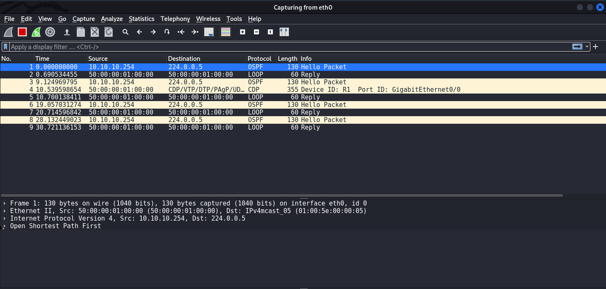
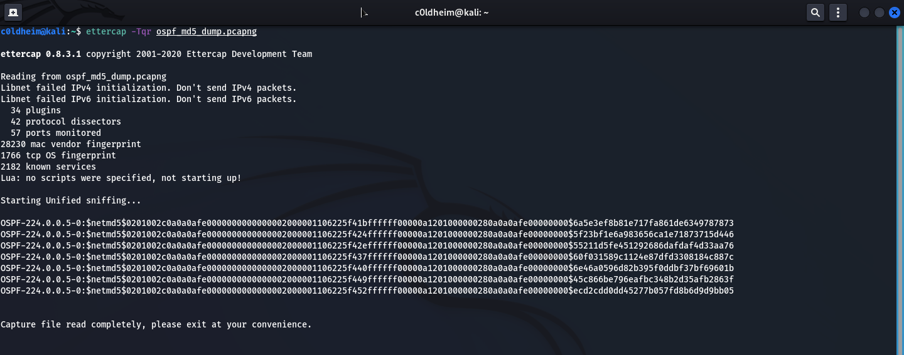
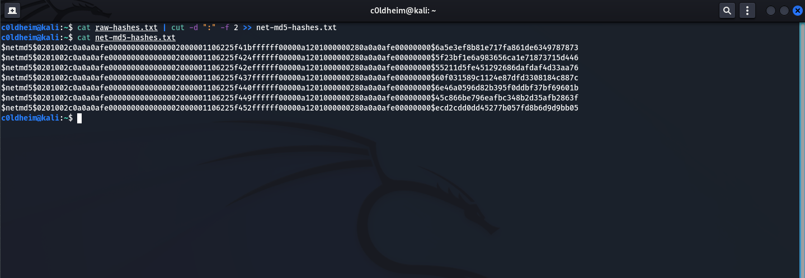
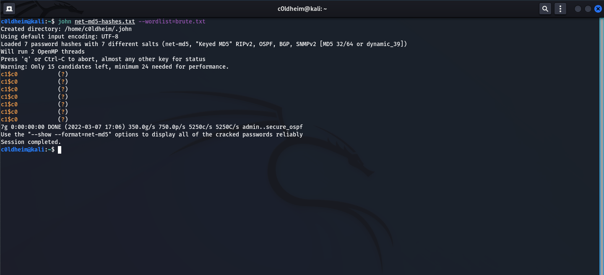
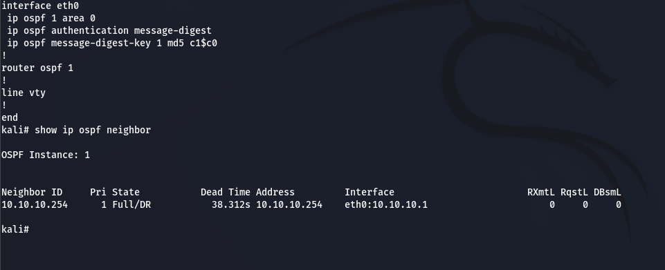

# OSPFMD5Crack

How to crack on OSPF MD5 hash manually.

This little guide is for pentesters who conduct a pentest under a contract. Do not use this information to destroy other people's networks.

## 1. Traffic dump

You can open Wireshark and replay the traffic dump by saving it to a pcapng file.



## 2. Extracting hashes using Ettercap

Using the Ettercap utility, we will be able to extract net-MD5 hashes from the traffic dump. ((OSPF uses net-MD5 hash) If you copy the hash value from the header "OSPF Authentication Crypt Data" and try to crack the password using the brute-force method, nothing will work.


Let's run Ettercap in console mode and feed it a traffic dump (a file with the extension .pcapng)

```
ettercap -Tqr ospf_md5_dump.pcapng
```



Using the cut, we will process the file with the hashes that Ettercap gave us.

```
cat raw-hashes.txt | cut -d ":" -f 2 >> net-md5-hashes.txt
```



## 3. Cracking net-MD5 hashes with John

Using John, we pass a file with hashes and a dictionary to the input. (brute-force attack)

```
john net-md5-hashes.txt --wordlist=brute.txt
```



Let's check the validity of the password and try to connect to the OSPF domain. Cracked password - c1$c0



We were able to crack the password from the OSPF domain and connect to the routing domain in area 0
